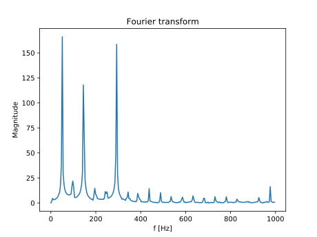

# About

This is an effort to make a guitar tuner using the STM32F4 Discovery board.

# Theory

Guitars in standard tuning have the following frequencies for the strings:

| String  | Freq (Hz)   |
|---------|-------------|
| E       | 82.41       |
| A       | 110.00      |
| D       | 146.80      |
| G       | 196.00      |
| B       | 246.90      |
| e       | 329.60      |

So to tune, we have to select a string, compare an input signals frequency it to this frequency and output either "higher" or "lower".

There are several techniques to get the frequency of a sampled signal. Some of the simpler ones are explained below.

## Zero crossing

## Fourier Transform

## Autocorrelation

# Hardware
To sample the guitar signal, which usually is a signal of +/- a few mV, we have to bring it into the ADC range of 0-3.3V.

To do this the following circuit is used:

{ width=50% }

# Code

# Results

Below an example of the D string, sampled at 2 khz:

{ width=50% }

And this is how the spectrum looks for this sample:

 { width=50% }

The three peaks correspond to 50Hz (from the outlet), 146 Hz (the root frequency) and 292 Hz (the second harmonic).

The root frequency that we're looking for is actually the lowest of these three peaks, so that makes it a little hard.

# TODO

- [ ] Faster autocorrelation
- [ ] Try zero crossing counting
- [ ] Using microphone input
- [ ] Output on LCD screen / LEDs
- [ ] Port to LL template
